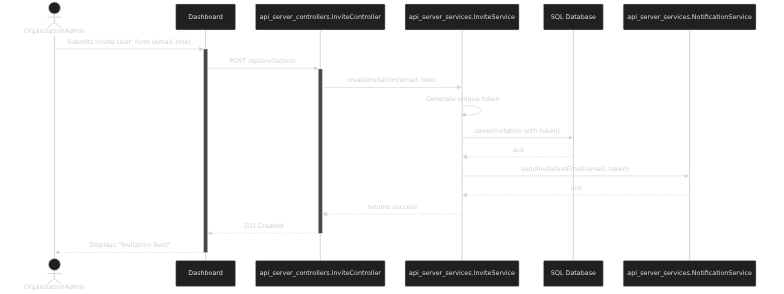

# System Design: AI Project Monitoring Platform

**Document Version:** 1.0
**Date:** August 28, 2025

This document outlines the system architecture and detailed design for the AI Project Monitoring Platform. The system is designed with a two-server architecture: a synchronous Go API server for handling user interactions and event ingestion, and an asynchronous Go Kafka consumer for data processing and aggregation.

## 1. Class Diagram

This diagram illustrates the high-level components, classes, and their relationships across the two main services. It uses flattened namespaces for maximum compatibility with Mermaid renderers.


## 2. Diagrams by Use Case
## UC-1.1: Manage Project (CRUD)

  * **Description:** Allows an Organization Administrator to create, update, or delete an AI project.
  * **Actor:** Organization Administrator (Org Admin)
  * **Preconditions:**
    1.  The user is authenticated and has the `ORG_ADMIN` role.
    2.  The user is on the UI Dashboard.
  * **Basic Flow (Update):**
    1.  The Org Admin navigates to the "Projects" page and selects a project to edit.
    2.  The Admin modifies the project's name or description in the UI form.
    3.  The Admin clicks "Save".
    4.  The UI Dashboard sends a `PUT` request to the `api_server`'s `/api/projects/{id}` endpoint with the updated data.
    5.  The `ProjectController` receives the request and calls the `ProjectService`.
    6.  The `ProjectService` validates the data and instructs the `Repository Layer` to update the corresponding record in the `projects` table of the SQL database.
    7.  The `AuditService` is called to log the "UPDATE_PROJECT" action.
    8.  The `api_server` returns a `200 OK` response with the updated project data.
    9.  The UI Dashboard displays a success message.
  * **Postconditions:**
      * The project's information is successfully updated in the database.
      * An entry is created in the `audit_logs` table.

### Flow Diagram


### Sequence Diagram


-----

## UC-1.2: Manage Project Access Control

  * **Description:** Allows an Org Admin to add members to a project, remove them, or change their roles.
  * **Actor:** Organization Administrator (Org Admin)
  * **Preconditions:**
    1.  The user is authenticated and has the `ORG_ADMIN` role.
    2.  The target project already exists.
  * **Basic Flow (Add Member):**
    1.  The Org Admin navigates to a specific project's "Access Control" tab.
    2.  The Admin searches for and selects a user within the organization.
    3.  The Admin assigns a project-specific role (e.g., `ENGINEER`).
    4.  The Admin clicks "Add Member".
    5.  The UI Dashboard sends a `POST` request to the `api_server`'s `/api/projects/{id}/members` endpoint.
    6.  The `ProjectController` calls the `ProjectService` to handle the logic.
    7.  The `ProjectService` creates a new entry in the `project_members` join table.
    8.  The `AuditService` logs the "ADD_PROJECT_MEMBER" action.
    9.  The `api_server` returns a `201 Created` response.
    10. The UI Dashboard refreshes the list of project members.
  * **Postconditions:**
      * The user's access permissions are updated in the `project_members` table.
      * An entry is created in the `audit_logs` table.

### Flow Diagram


### Sequence Diagram


-----

## UC-1.3: Propose Alert Rule

  * **Description:** Allows an Engineer to propose a new alert rule for a project, which must be approved by a Reviewer.
  * **Actor:** Engineer
  * **Preconditions:**
    1.  The user is authenticated and has the `ENGINEER` role for the project.
  * **Basic Flow (Proposal):**
    1.  The Engineer navigates to the project's "Alerts" tab and defines a new rule.
    2.  Upon submission, the UI Dashboard sends a `POST` request to the `api_server`.
    3.  The `api_server` creates a new record in the `alert_rules` table with a `status` of `PROPOSED`.
    4.  The system notifies users with the `REVIEWER` role that a proposal is ready.
  * **Postconditions:**
      * A new alert rule is created in the database with a `PROPOSED` status.
      * An audit log is created for the proposal.

### Flow Diagram


### Sequence Diagram


-----

## UC-2.1: Push Monitoring Event

  * **Description:** An external AI service sends monitoring data to the platform's API endpoint.
  * **Actor:** AI Service
  * **Preconditions:**
    1.  A valid, active API key has been generated for the project.
    2.  The AI service is configured with the API key and endpoint URL.
  * **Basic Flow:**
    1.  The AI Service constructs a JSON payload for a `MonitoringEvent`.
    2.  It sends an HTTP `POST` request to the `api_server`'s `/events/{eventType}` endpoint with the API key.
    3.  The `EventController` receives the request and calls the `AuthService` to validate the API key.
    4.  The controller validates the JSON payload.
    5.  The controller passes the event to the `EventProducerService`, which publishes it to a Kafka topic.
    6.  The `api_server` immediately returns a `202 Accepted` response.
  * **Postconditions:**
      * The monitoring event is successfully published to a Kafka topic.

### Flow Diagram


### Sequence Diagram


-----

## UC-2.2: Process & Aggregate Event

  * **Description:** The backend consumer processes events from Kafka, aggregates data, and evaluates alerts. This is a purely backend process.
  * **Actor:** System (Go Kafka Consumer)
  * **Preconditions:**
    1.  A `MonitoringEvent` message exists in a Kafka topic.
    2.  The `kafka_consumer` service is running.
  * **Basic Flow:**
    1.  The `EventProcessor` consumes a message from Kafka.
    2.  The message is passed to the `DataAggregator`, which creates and writes `AggregatedMetric` records to the SQL database.
    3.  The event is then passed to the `AlertEvaluator`.
    4.  The `AlertEvaluator` queries the database for active rules. If a rule's condition is met, it calls the `NotificationService`.
  * **Postconditions:**
      * New analytical data is available in the `aggregated_metrics` table.
      * An alert notification is sent if a threshold was breached.

### Flow Diagram


### Sequence Diagram


-----

# Comprehensive Use Case & Diagram Specification

**Document Version:** 1.2
**Date:** August 28, 2025

This document provides a complete specification for each use case of the AI Project Monitoring Platform, accompanied by detailed flow and sequence diagrams to illustrate the interactions.

---

## UC-1: Manage Project (CRUD)

* **Description:** Allows an Organization Administrator to create, update, or delete an AI project.
* **Actor:** Organization Administrator (Org Admin)
* **Preconditions:**
    1.  The user is authenticated and has the `ORG_ADMIN` role.
    2.  The user is on the UI Dashboard.
* **Basic Flow (Update):**
    1.  The Org Admin navigates to the "Projects" page and selects a project to edit.
    2.  The Admin modifies the project's name or description in the UI form.
    3.  The Admin clicks "Save".
    4.  The UI Dashboard sends a `PUT` request to the `api_server`'s `/api/projects/{id}` endpoint with the updated data.
    5.  The `ProjectController` receives the request and calls the `ProjectService`.
    6.  The `ProjectService` validates the data and instructs the `Repository Layer` to update the corresponding record in the `projects` table of the SQL database.
    7.  The `AuditService` is called to log the "UPDATE_PROJECT" action.
    8.  The `api_server` returns a `200 OK` response with the updated project data.
    9.  The UI Dashboard displays a success message.
* **Postconditions:**
    * The project's information is successfully updated in the database.
    * An entry is created in the `audit_logs` table.

### Flow Diagram


### Sequence Diagram


-----

## UC-2: Manage Project Access Control

  * **Description:** Allows an Org Admin to add members to a project, remove them, or change their roles.
  * **Actor:** Organization Administrator (Org Admin)
  * **Preconditions:**
    1.  The user is authenticated and has the `ORG_ADMIN` role.
    2.  The target project already exists.
  * **Basic Flow (Add Member):**
    1.  The Org Admin navigates to a specific project's "Access Control" tab.
    2.  The Admin searches for and selects a user within the organization.
    3.  The Admin assigns a project-specific role (e.g., `ENGINEER`).
    4.  The Admin clicks "Add Member".
    5.  The UI Dashboard sends a `POST` request to the `api_server`'s `/api/projects/{id}/members` endpoint.
    6.  The `ProjectController` calls the `ProjectService` to handle the logic.
    7.  The `ProjectService` creates a new entry in the `project_members` join table.
    8.  The `AuditService` logs the "ADD_PROJECT_MEMBER" action.
    9.  The `api_server` returns a `201 Created` response.
    10. The UI Dashboard refreshes the list of project members.
  * **Postconditions:**
      * The user's access permissions are updated in the `project_members` table.
      * An entry is created in the `audit_logs` table.

### Flow Diagram


### Sequence Diagram


-----

## UC-3: Propose Alert Rule

  * **Description:** Allows an Engineer to propose a new alert rule for a project, which must be approved by a Reviewer.
  * **Actor:** Engineer
  * **Preconditions:**
    1.  The user is authenticated and has the `ENGINEER` role for the project.
  * **Basic Flow (Proposal):**
    1.  The Engineer navigates to the project's "Alerts" tab and defines a new rule.
    2.  Upon submission, the UI Dashboard sends a `POST` request to the `api_server`.
    3.  The `api_server` creates a new record in the `alert_rules` table with a `status` of `PROPOSED`.
    4.  The system notifies users with the `REVIEWER` role that a proposal is ready.
  * **Postconditions:**
      * A new alert rule is created in the database with a `PROPOSED` status.
      * An audit log is created for the proposal.

### Flow Diagram


### Sequence Diagram


-----

## UC-4: Push Monitoring Event

  * **Description:** An external AI service sends monitoring data to the platform's API endpoint.
  * **Actor:** AI Service
  * **Preconditions:**
    1.  A valid, active API key has been generated for the project.
    2.  The AI service is configured with the API key and endpoint URL.
  * **Basic Flow:**
    1.  The AI Service constructs a JSON payload for a `MonitoringEvent`.
    2.  It sends an HTTP `POST` request to the `api_server`'s `/events/{eventType}` endpoint with the API key.
    3.  The `EventController` receives the request and calls the `AuthService` to validate the API key.
    4.  The controller validates the JSON payload.
    5.  The controller passes the event to the `EventProducerService`, which publishes it to a Kafka topic.
    6.  The `api_server` immediately returns a `202 Accepted` response.
  * **Postconditions:**
      * The monitoring event is successfully published to a Kafka topic.

### Flow Diagram


### Sequence Diagram


-----

## UC-5: Process & Aggregate Event

  * **Description:** The backend consumer processes events from Kafka, aggregates data, and evaluates alerts. This is a purely backend process.
  * **Actor:** System (Go Kafka Consumer)
  * **Preconditions:**
    1.  A `MonitoringEvent` message exists in a Kafka topic.
    2.  The `kafka_consumer` service is running.
  * **Basic Flow:**
    1.  The `EventProcessor` consumes a message from Kafka.
    2.  The message is passed to the `DataAggregator`, which creates and writes `AggregatedMetric` records to the SQL database.
    3.  The event is then passed to the `AlertEvaluator`.
    4.  The `AlertEvaluator` queries the database for active rules. If a rule's condition is met, it calls the `NotificationService`.
  * **Postconditions:**
      * New analytical data is available in the `aggregated_metrics` table.
      * An alert notification is sent if a threshold was breached.

### Flow Diagram


### Sequence Diagram


-----

## UC-6: View and Filter Dashboard

  * **Description:** Allows an authorized user to view project performance dashboards and customize the view by filtering by a time range or model version.
  * **Actor:** Organization Admin, Engineer, Reader, Reviewer
  * **Preconditions:**
    1.  The user is authenticated and has at least `READER` permissions for the project.
    2.  The `kafka_consumer` has processed events and populated the `aggregated_metrics` table.
  * **Basic Flow:**
    1.  The user navigates to a project's dashboard page. The UI Dashboard sends a default `GET` request to the `api_server`.
    2.  The user applies a filter (e.g., "Last 7 Days", "Model Version 1.2").
    3.  The UI Dashboard sends a new `GET` request to the `api_server`'s `/api/dashboard/{projectId}` endpoint with the filter parameters in the query string.
    4.  The `DashboardController` receives the request and calls a `DashboardService`.
    5.  The `DashboardService` builds a SQL query based on the filters and queries the `aggregated_metrics` table.
    6.  The database returns the aggregated data.
    7.  The `api_server` returns a `200 OK` response with the data formatted as a JSON object for the charts.
    8.  The UI Dashboard re-renders the charts and KPIs with the new data.
  * **Postconditions:**
      * The user can view the performance metrics for the selected project and filters.

### Flow Diagram


### Sequence Diagram


-----

## UC-7: View System Logs

  * **Description:** Allows an Organization Administrator or Reviewer to view the history of critical system changes (e.g., permissions, configurations).
  * **Actor:** Organization Administrator, Reviewer
  * **Preconditions:**
    1.  The user is authenticated and has the required role.
    2.  Actions have been performed in the system, generating log entries.
  * **Basic Flow:**
    1.  The user navigates to the "Settings" -> "Audit Log" page.
    2.  The UI Dashboard sends a `GET` request to the `api_server`'s `/api/auditlog` endpoint.
    3.  The `AuditLogController` calls the `AuditLogService`.
    4.  The `AuditLogService` queries the `audit_logs` table in the database.
    5.  The `api_server` returns a `200 OK` response with a paginated list of log entries.
    6.  The UI Dashboard displays the logs in a table.
  * **Postconditions:**
      * The user can view a complete audit trail of important system actions.

### Flow Diagram


### Sequence Diagram


-----

## UC-8: Export Reports

  * **Description:** Allows an authorized user to download raw monitoring data as a CSV file or a summary report as a PDF.
  * **Actor:** Organization Admin, Engineer, Reader, Reviewer
  * **Preconditions:**
    1.  The user is authenticated and has view permissions for the project.
    2.  Data is available for the selected time range.
  * **Basic Flow:**
    1.  On a dashboard page, the user clicks the "Export" button and selects a format (e.g., CSV).
    2.  The UI Dashboard sends a `GET` request to the `api_server`'s `/api/export/{projectId}?format=csv` endpoint, including any active filters.
    3.  The `ReportController` receives the request.
    4.  It calls a `ReportService`, which fetches the relevant data from the `aggregated_metrics` table.
    5.  The `ReportService` generates the file (e.g., a CSV string) in memory.
    6.  The `api_server` returns a `200 OK` response with the appropriate `Content-Type` header (e.g., `text/csv`) and the file content in the body.
    7.  The user's browser prompts them to download the file.
  * **Postconditions:**
      * The user successfully downloads a report file.
      * The export action is recorded in the `audit_logs` table.

### Flow Diagram


### Sequence Diagram


-----

## UC-9: Manage Organization Members

  * **Description:** Allows an Organization Administrator to invite new users to the organization and manage their roles.
  * **Actor:** Organization Administrator (Org Admin)
  * **Preconditions:**
    1.  The user is authenticated and has the `ORG_ADMIN` role.
  * **Basic Flow (Invite):**
    1.  The Org Admin navigates to "Organization" -> "Members" and clicks "Invite".
    2.  The Admin enters the new user's email address and assigns an organization-level role (e.g., `MEMBER`).
    3.  The UI Dashboard sends a `POST` request to the `api_server`'s `/api/invitations` endpoint.
    4.  The `InvitationController` calls an `InvitationService`.
    5.  The `InvitationService` creates a new record in an `invitations` table with a unique token and an expiration date.
    6.  The `InvitationService` calls a `NotificationService` (e.g., an email service).
    7.  The `NotificationService` sends an invitation email to the specified address containing a unique sign-up link.
    8.  The `api_server` returns a `201 Created` response.
  * **Postconditions:**
      * An invitation is created and sent to the prospective user.
      * The action is recorded in the `audit_logs` table.

### Flow Diagram


### Sequence Diagram



```